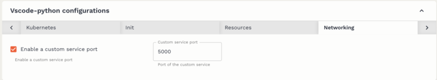
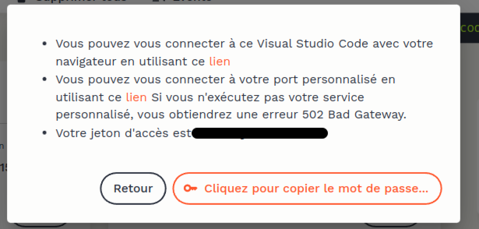

<h1 align="center">🤖 Hackaton 2024 AI VS IA</h1>

## ✨ Description du projet

L'objectif du projet est de maximiser les performances d'un modèle sur une tâche de classification de textes humains et artificiellement générés.

## 🚀 Utilisation

### Utilisation des modèles

Assurez-vous d'avoir [python](https://docs.python.org/3/index.html) et [pip](https://pip.pypa.io/en/stable/index.html) installés sur votre machine.

Entrez les commandes ci-dessous pour installer toutes les dépendances nécessaires

```sh
pip install -r requirements.txt
```

### Tableau de bord d'analyse
Si vous souhaitez accéder au tableau de bord d'analyse des jeux de données, il vous faudra:




1. Pour l'environnement Onyxia:

- Il faudra créer un service avec la configuration suivante:

Puis vous devrez entrer la commande suivante:

```sh
python dashboard.py
```


2. Sur votre environnement personnel:

Il suffira de rentrer la commande suivante:

```sh
python dashboard.py
```

Et de cliquer sur le l'URL donnée dans votre terminal.

## Auteurs

👤 **Clovis Lechien**

- LinkedIn: [@ClovisLechien](https://www.linkedin.com/in/clovis-febvre-lechien/)
- Github: [@DyArx](https://github.com/ClovisDyArx)

👤 **Robin Levasseur**

- LinkedIn: [@RobinLevasseur](https://www.linkedin.com/in/robin-levasseur-932118243/)
- Github: [@robinlevasseurAS](https://github.com/robinlevasseurAS)

👤 **Loris Lin**

- LinkedIn: [@LorisLin](https://www.linkedin.com/in/loris-lin-577655267/)
- Github: [@LorisLin](https://github.com/LorisLin)

👤 **Léa Margery**

- LinkedIn: [@LéaMargery](https://www.linkedin.com/in/léa-margery/)
- Github: [@lea-margery](https://github.com/lea-margery)

👤 **Alexandre Mouton-Bistondi**

- LinkedIn: [@AlexandreMouton-Bistondi](https://www.linkedin.com/in/alexandre-mouton-bistondi-1099a927b)
